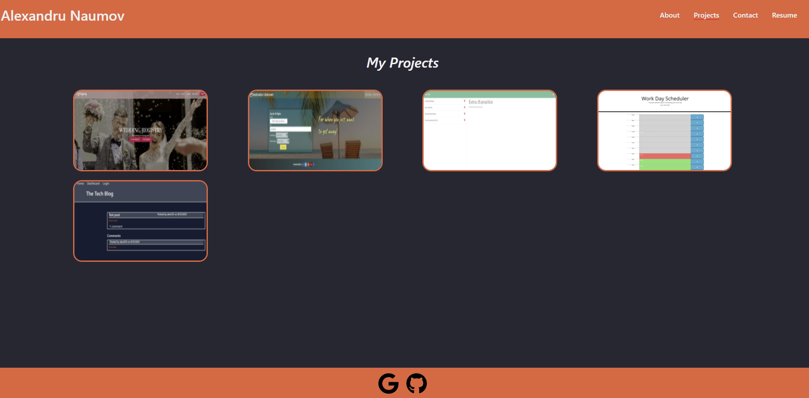

# Alex Naumov React Portfolio 

## Description

This application is a portfolio of my work.

## Table of Contents

- [Installation](#installation)
- [Usage](#usage)
- [License](#license)

## Installation

No instalation required, please follow the live link to view the deployed portfolio.

## Usage

Simple React SPA where you can view some of my projects and get an idea of who I am. There is a contact page where you can send me an email if you wish to talk to me.

## License

### MIT

This application is covered under the MIT license. To learn more about this license,
please click the link. [MIT](https://choosealicense.com/licenses/mit/)

## Screenshot

## Questions
[Live-App](https://anaumov1.github.io/anaumov-portfolio/)

[GitHub page](https://github.com/anaumov1/anaumov-portfolio)

Email Address: Alexandru.naumov@gmail.com

